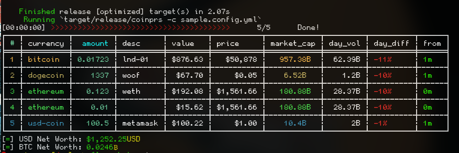

# Coinprs 💰

A pretty simple config-powered price tracking cli :crab:

## Features

-   Track hundreds of token prices with CoinGecko API (thanks! 🐍).
-   Outrageously customizable, fast, cross-platform, 2.1mb!
-   **YAML** configuration files, plus support for TOML/JSON/HJSON/INI.
-   Well suited for cli / stdio / cronjob interactions
-   Make your own red-green colourblind mode (or fully `#CUST0M` hex colours!) ❤️

#### Screenshots



## Setup

Docker

```bash
cd docker/ && docker-compose build
```

Cargo
```bash
cargo build --release
```

## Basic Configuration

By default we check for a file named `coinprs.[yml/yaml/toml/json]` in the current directory (`.`), the user's home (`$HOME`), and finally (`$HOME/.config/`). YAML Is recommended for non-programmatic use.

There are 3 main sections;

-   `assets:` is meant for our data source (ie: I own x and want to track it)
-   `money:` is focused on currency / rounding (ie: I want USD conversion)
-   `table:` is focused on styling / alignment (ie: I want periwinkle numbers)

**Sample Basic Configuration:**

```yml
# tldr: configure your local currency, add some assets, type `coinprs report`
table:
  title: alt coin yoloview
  sort: market_cap
  reverse: true
  layout: [] # custom order of columns
  localize: # styling headers, rows with tints and text align
    headers:
      num:
        text: "#" # replacing the index column title
        color: green # or #GREEEN for hex codes
        rows:
          align: right

      asset:
        tint: red
        rows:
          tint:

assets:
  - bitcoin:
      desc: exchange funds
      amount: 0.3

  - bitcoin:
      desc: cold storage
      amount: 0.00432
      tint: "#icyblu"
      decimals: 4 # override global money decimals

  - ethereum:
      desc: browsers
      amount: 0.05

  - ethereum:
      desc: weth
      amount: 0.02

  - dogecoin:
      amount: 1337

# we'll use the "money:" defaults
# money:
#   currencies:
#     - usd
```

@TODO Screenshot here

See [this](./yaml) same example written in [toml](./toml) or [json](./json) or [ini](./ini)!

###

This is the main point, although considering accessbility like red/green colourblindness the app also has a method for customizing most assets, or maybe you want to make things look awesome? Read on for the full picture / check the examples!

#### `assets:`

Full documentation of current options in the asset field. Welcome to the 🍖.

```yml
# assets contains an array of entries
assets: # top level key

  # an example of one asset in our array
  - bitcoin: # the top level declaration is queried on coingecko
    amount: 0.243675 # The portion owned of the asset
    tint: "#ffb22e" # a hex color assumes "tint" value in rows: style
    desc: trezor #
    decimals: 6 # override the decimals shown in qty

  # another bitcoin asset, this time a gemini account
  - bitcoin:
    amount: 0.012
    tint: "Purple"
    desc: gemini

  # many currencies are supported
  # they can all be listed then queried with `coinprs list | grep "REGEX"`
  - ethereum:
    amount: 0.0000001
    decimals: 10
    tint: "#greeny"
```

#### `money:`

Full documentation of current options in the table field., for outputting currency.

```yml
money: # top level key

  currencies: # list of supported currencies, default = - USD
    - USD # Most ISO currency codes are supported like EUR, SEK,
    - BTC # you can convert alts to approx bitcoin prices also
    # - the extra prices will appear on the far right side of your table

  round: 2 # overridable # of decimals shown for assets, global version of
                         # global version of assets:
                         #                    bitcoin:
                         #                      round: 2
```

#### `table:`

Full documentation of current options in the table field., for styling and formatting. Demonstrated by making a colourblind theme.

```yml
table: # top level key
  # contains ->
  # "exclude:" / "include" to hide/rearrage layouts.
  # "localize:" for text / style / alignment
  # "sort:" to control how the table is sorted

  sort:
    col: value # sort by data in "value" column
    # for numeric it sorts by 1 = largest num
    # for text it sorts alphabetically, 1 = a
    reverse: true # sort into the opposite order

  exclude: # an array of columns to exclude
  # easiest way to hide 1-2 columns
    - market_cap
    - price

  include: # an array in order of how to display
  # best way to rearrage layout
    - num
    - currency
    - desc
    - value
    - price # makes "exclude:" ineffective
    # there is no reason to use "include:" and "exclude:" at the same time

  style: # array of settings for headers/their rows
  # place to customize most fields

    num: # col header name
      title: "#" # displays a "#" instead of the title "num"
      tint: "#abc345" # hex color code
      align: center # center in the field
      rows: # array of settings for the rows
        align: right #
        tint: "#abcaba" # different color line numbers


    desc: # col header name
      tint: "#anothe" # another hex tint, but notice below...
      rows:
        tint: tint # special value that uses the "tint:" of the asset in the row, for 🌈
        # BUT DO NOT use "tint: tint" in the header since it's not an asset it has none

    currency:
      title: abc
```

Voila! These can be applied many times over, I have included three complex versions in `sample_configs/`.

## Basic Usage

**Examples:**

List supported coins in config.

```sh
coinprs list
...snip...
coinprs list | grep btc
bitcoin btc
```

Print out and optionally (-s)aving output to a file.

```sh
coinprs report -s # -q can hide the table
Saved to ./coinprs.2020-01-31.14.36.55.txt
# alternatively, lets redirect to a file with no output
coinprs report > $TIME.txt
```

## Build

This project can be built from source using a docker container using `docker-compose`.

```bash
git clone https://gitlab.com/candoizo/coinprs
cd coinprs/docker && docker-compose build
```

## Issues

Please include your operating system, rust versions, configuration, where you installed the package / how you are using it. Thanks in advance!

If you have a particular feature request or inconsistency wirth addressing, include reasoning for why it would be a good change. Thanks!

## @TODO

- Things that aren't done, for sure.

## License

Apache 2.0 License
